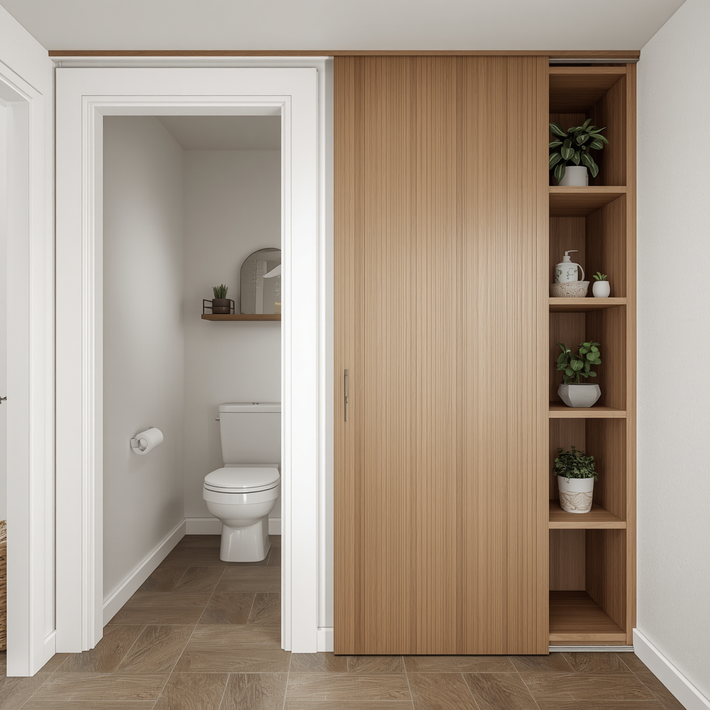
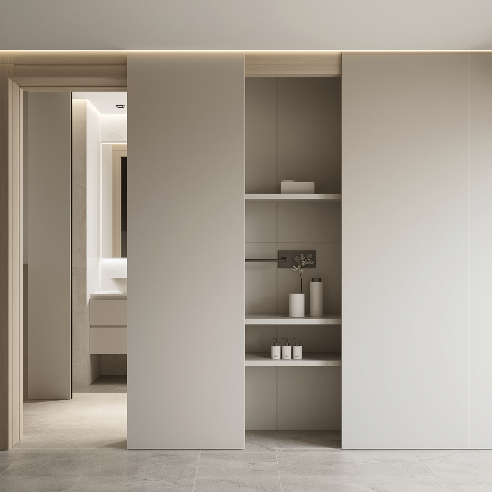

# Doorcase: Modular Space-Saving Door System

A wall-mounted system that transforms unused door space into functional storage.

---

## 🧩 Problem

- Traditional doors waste usable surface area  
- Sliding solutions reduce wall usability  
- Compact urban homes require multi-functional design  

---

## 👤 User Context

Designed for:
- Small homes  
- Urban apartments  
- Bathrooms & kitchens  

---

## 💡 Key Insight

The problem is not lack of space, but inefficient use of space.

---

## 🚪 Solution: What is Doorcase?

Doorcase is a wall-mounted system where:

- The door slides into a concealed wall cavity  
- The outer panel remains fixed  
- The panel functions as storage or decor  

---

## ⚙️ How It Works

1. Door slides into a hidden wall cavity  
2. Outer panel stays accessible  
3. Panel is used for storage / shelving  
4. No obstruction to movement  

---

## ✨ Value Proposition

- Adds storage without increasing footprint  
- Saves floor space  
- Works in compact homes  
- No major redesign required  

---

## ⚠️ Trade-offs / Constraints

- Slightly thicker wall profile  
- Moisture concerns (bathroom use)  

---

## 📈 Business Potential

- Increasing demand in urban housing  
- Modular and scalable system  
- Can integrate with interior brands  

---

## 🛠️ Next Steps

- Prototype development  
- User testing  
- Design iteration  

---

## 📸 Visuals

---

## 👩‍💻 Author

Pranjali Khandare
